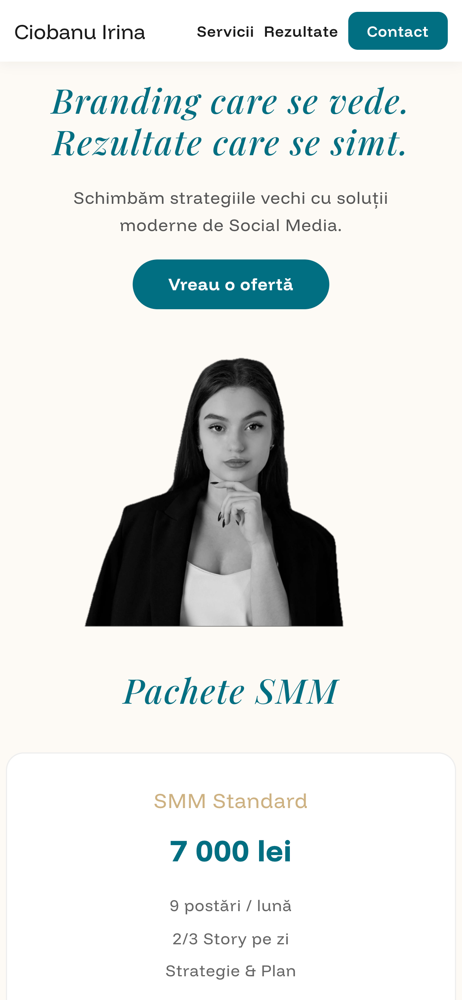
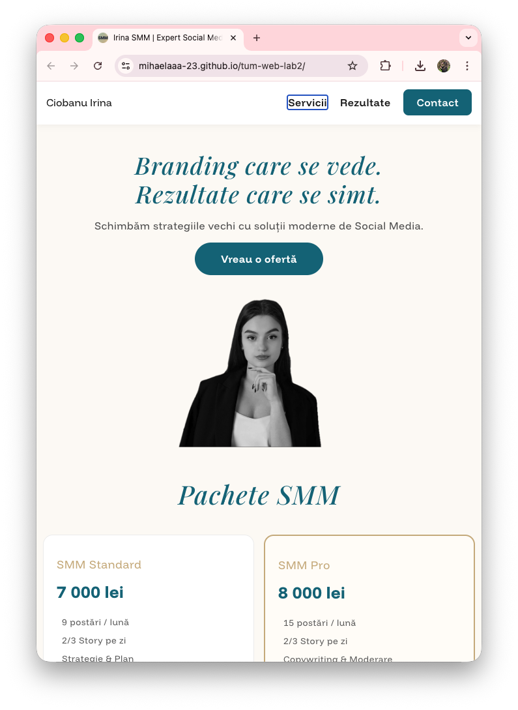

# Social Media Management Landing Page

A modern, responsive landing page for a professional Social Media Management service showcasing SMM packages, results, and portfolio.

## 🎯 About

This landing page presents Ciobanu Irina's SMM services, featuring:
- **Service Packages**: SMM Standard, SMM Pro, TikTok Boost, and custom solutions
- **Real Results**: Proven growth metrics from previous campaigns
- **Portfolio**: Video showcases of successful client projects
- **Contact Information**: Direct communication channels for inquiries

## ✨ Features

- 📱 **Fully Responsive Design** - Optimized for desktop, tablet, and mobile devices
- 🎨 **Modern UI/UX** - Clean design with professional color scheme
- ⚡ **Fast Loading** - Vanilla HTML & CSS for optimal performance
- 🎯 **Strategic Layout** - Focused on conversion and user engagement
- 📊 **Results** - Highlighting real metrics and achievements

## 🛠️ Technologies

- HTML5
- CSS3 (Vanilla CSS with custom properties)
- Google Fonts (Playfair Display & Funnel Display)
- Responsive Design (Mobile-first approach)

## 📸 Screenshots

### Desktop View

<!--  -->

### Mobile View

### Tablet View

## 🚀 Live Demo

**[View Live Demo →](https://mihaelaaa-23.github.io/tum-web-lab2/)**

## 🎨 Color Palette

- **Primary Color**: `#026E82` (Teal)
- **Secondary Color**: `#CDB181` (Gold)
- **Dark Color**: `#1a1a1a` (Near Black)
- **Light Color**: `#fdfaf5` (Cream)

## 📱 Responsive Breakpoints

- Mobile: `max-width: 480px`
- Tablet: `max-width: 768px`
- Desktop: `768px+`

## 🤝 Contributing

This is a university project for the Web Programming course at TUM (Technical University of Moldova).

## 📄 License

This project is created for educational purposes as part of the Web Programming Laboratory Work #2.